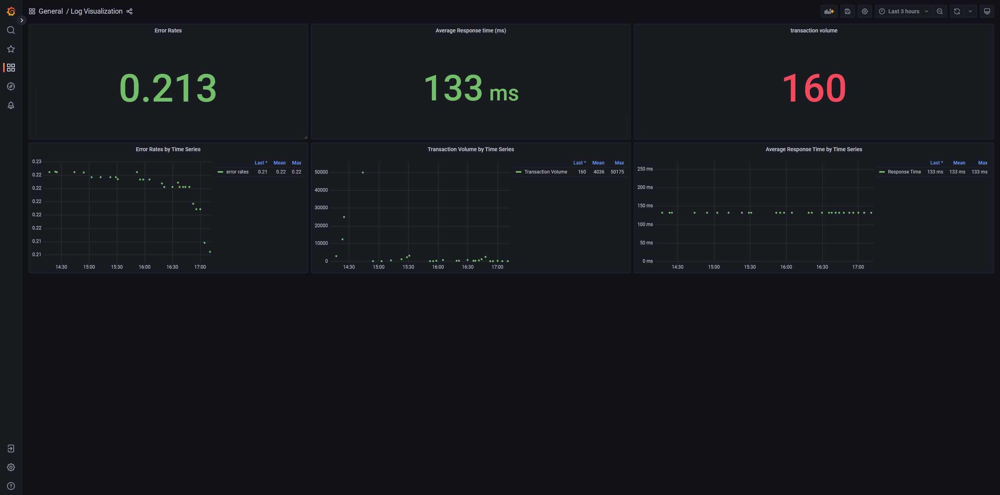
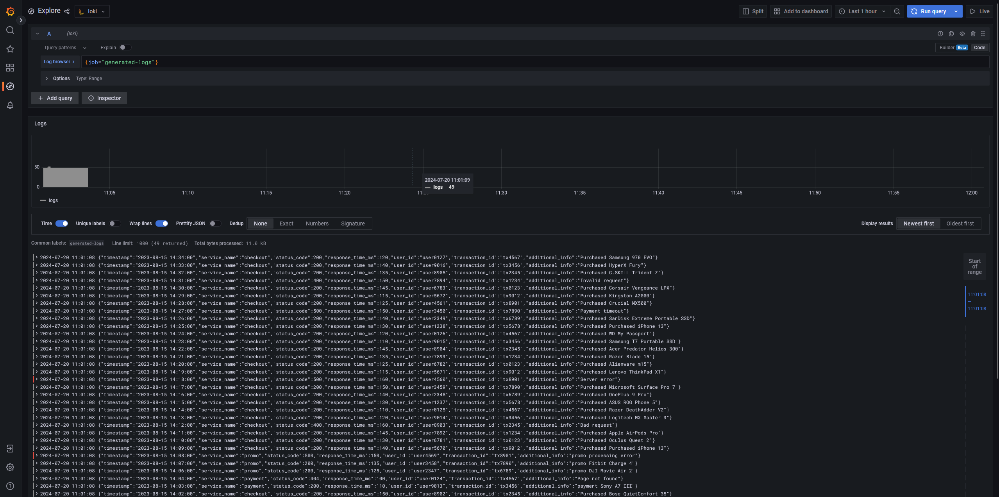
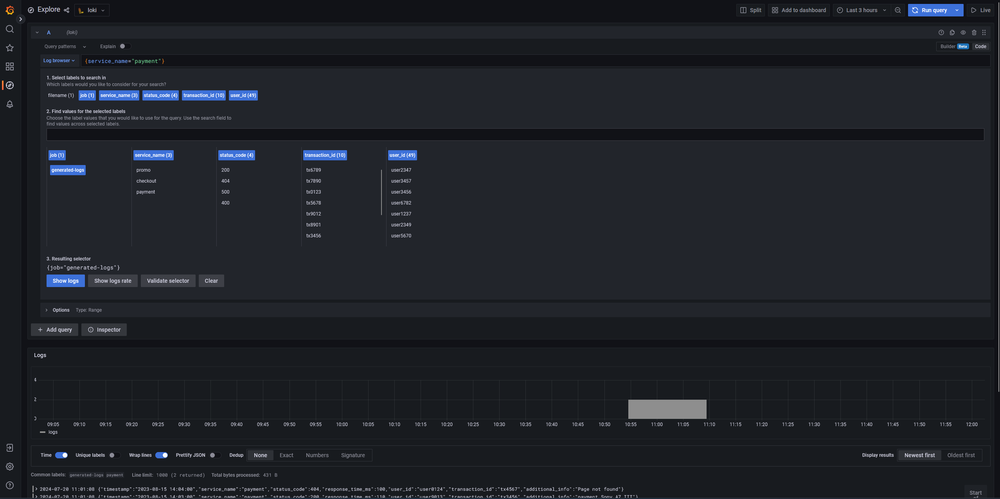
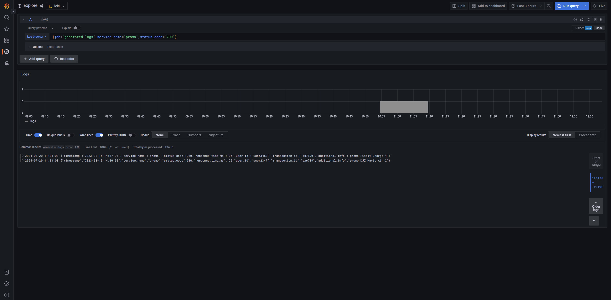
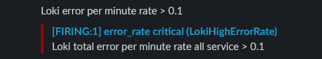

## Introduction

### Folder Structure
1. ./image: list of all images png
2. ./loki: all stuff about loki
3. ./loki/alert-rules: loki configuration for alert
4. ./loki/config/: configuration related to deploy loki
5. ./main.go: tools log generator to json
6. ./sample.log: sample of log

### Grafana Loki
Loki is a log aggregation system designed by Grafana Labs that is optimized for cost-effective operation and scalability. It is often compared to other log management solutions like Elasticsearch, Splunk, and the ELK stack. <br>

*Pros* 
1. Cost-Effective: Loki only indexes metadata such as labels and keeps the logs themselves in cloud storage like AWS S3 or GCS, significantly reducing storage costs. <br>
2. Scalable: Loki is designed to scale horizontally, making it suitable for handling large volumes of logs from multiple sources without significant performance degradation. <br>
3. Integration with Grafana: Loki integrates seamlessly with Grafana, providing powerful visualization capabilities and allowing users to create dashboards and alerts based on log data. <br>
4. Label-Based Logging: Loki uses a label-based approach to organize and query logs, making it easier to filter and search logs by specific attributes (e.g., pod name, namespace, container). <br>
5. Lightweight: Loki is designed to be lightweight, consuming fewer resources compared to traditional logging solutions like the ELK stack. <br>

*Cons*
1. Limited Indexing: Loki only indexes metadata (labels) and not the full text of the logs. While this is good for reducing storage costs, it can limit search capabilities if you need full-text search. <br>
2. Performance: In some cases, Loki's performance for complex queries might not match the performance of more mature log management systems that index the full text of logs. <br>

### Query logql

*Error Rates*
```
sum(rate({job="generated-logs", status_code=~"4..|5.."} | json [$__interval])) / sum(rate({job="generated-logs"}[$__interval]))
```

*Average Response Time*
```
avg(avg_over_time({job="generated-logs"} |json | unwrap response_time_ms [$__interval]))
```

*Transaction Volume*
```
sum(count_over_time({job="generated-logs"} | json |= `transaction_id` [$__interval]))
```

### Tools generate log to json
this tools is to convert text model log to json model log and generate it. sample raw log on sample.log file and the generate output on generated.log file (after you run the tools)


## how to run tools
1. `go run main.go` <br>
2. generate.log file will be generate <br>

## how to deploy grafana loki 
1. `cd loki` <br> 
2. `docker-compose up -d`

Simply run docker-compose up and all the components will start.

It'll take a few seconds for all the components to start up and register in the ring. Once all instances are ACTIVE, Loki will start accepting reads and writes. All logs will be stored with the tenant ID docker.

All data will be stored in the .data directory.

The nginx gateway runs on port 8080 and you can access Loki through it.

Prometheus runs on port 9090, and you can access all metrics from Loki & Promtail here.

Grafana runs on port 3000, and there are Loki & Prometheus datasources enabled by default.

### Component grafana loki

- Running in [Simple Scalable Deployment](https://grafana.com/docs/loki/latest/fundamentals/architecture/deployment-modes/#simple-scalable-deployment-mode) mode with 3 replicas for `read` and `write` targets
- Memberlist for [consistent hash](https://grafana.com/docs/loki/latest/fundamentals/architecture/rings/) ring
- [Minio](https://min.io/) for S3-compatible storage for chunks & indexes
- nginx gateway which acts as a reverse-proxy to the read/write paths
- Promtail for logs
  - An optional log-generator
- Multi-tenancy enabled (`docker` as the tenant ID)

## import dashboard
1. go to menu Dashboard -> button import -> upload JSON file Log on config/Visualization-1721451445333.json


## Dashboard logging

## show all logs on grafana explore


## show log label on grafana explore


## show filter log by response code on grafana explore


## show alert error rate 



